# sqlapp

**sqlapp** is a Gradle-based database engineering toolkit that unifies schema management, documentation generation, test data generation, and data import/export into a single Gradle workflow.

It provides a comprehensive schema model, HTML documentation, schema diff analysis, high-performance streaming data generation, and flexible data transformation across multiple formats.

## ✨ Key Features

### 🚀 Schema Management

* Schema version management
* XML-based schema export
* Schema comparison and diff
* SQL generation and migration support

📖 **Learn more:** [`docs/migration.md`](docs/migration.md) · [`docs/schema-model.md`](docs/schema-model.md) · [`docs/schema-diff.md`](docs/schema-diff.md)

---

### 📖 HTML Documentation

Generate searchable HTML documentation with ER Diagram directly from the database schema.

Supports:

* Tables and columns
* Keys and constraints
* Views and sequences
* Functions and stored procedures (including source code)
* Synonyms
* Tablespaces
* Partitioning metadata
* SQL Server Partition Functions / Partition Schemes
* PostgreSQL `INHERITS`
* External Tables



📖 **Learn more:** [`docs/html-documentation.md`](docs/html-documentation.md)

---

### 📚 Dictionary Management

Generate editable dictionary templates (`tables.xlsx`, `columns.xlsx`, etc.) from the schema.

Business-friendly names and descriptions can be maintained in Excel or CSV or YAML and automatically reflected in the generated HTML documentation.

📖 **Learn more:** [`docs/dictionary.md`](docs/dictionary.md)

---

### 🔗 Logical Foreign Keys

Document logical relationships that do not exist as physical foreign key constraints.

Example:

```text
#job_details->jobs
#user_jobs(created_at, id)->jobs(created_at, id)
```

These relationships are visualized in the generated documentation and ER diagrams.

📖 **Learn more:** [`docs/logical-foreign-keys.md`](docs/logical-foreign-keys.md)

---

### 🌊 Test Data Generation

Generate realistic relational test data with automatic foreign key dependency analysis.

Features include:

* Streaming architecture
* Tens of millions of rows
* MVEL expressions
* Custom Java static functions
* Configurable JDBC batching
* Iterator, SQL, CSV, TSV, and file-based data sources
* Excel ↔ YAML configuration conversion

📖 **Learn more:** [`docs/data-generation.md`](docs/data-generation.md)

---

### 🔄 Data Import / Export

Import and export data using a streaming architecture.

Supported formats include:

* Database tables
* CSV
* TSV
* Excel
* YAML
* JSONL

Supports MVEL-based transformation and binary (`InputStream`) handling.

📖 **Learn more:** [`docs/data-import-export.md`](docs/data-import-export.md)

---

### 🔄 Format Conversion

Convert data between supported formats without writing custom scripts.

Examples include:

* CSV ⇔ TSV
* CSV ⇔ Excel
* Excel ⇔ YAML
* JSONL ⇔ CSV

Generator configuration conversion (Excel ⇔ YAML) is also supported.

📖 **Learn more:** [`docs/format-conversion.md`](docs/format-conversion.md)

---

### ☕ MVEL & Java Extensions

Customize generation and transformation logic using MVEL expressions and user-defined Java static methods.

Examples:

* Custom ID generation
* Data normalization
* Business rule implementation
* Date and string utilities
* Weighted random generation

📖 **Learn more:** [`docs/mvel.md`](docs/mvel.md)

---

## 🏗️ Architecture

```text
                    Database
                        │
                        ▼
                  Schema Export
                        │
                        ▼
                   Schema XML
          ┌─────────────┼─────────────┐
          │             │             │
          ▼             ▼             ▼
    HTML Documentation  Schema Diff  Dictionaries
          │
          ▼
  Logical Foreign Keys

CSV / TSV / Excel / YAML / JSONL / SQL / Iterator
                        │
                        ▼
              MVEL + Java Extensions
                        │
                        ▼
              Streaming Processing
                        │
                        ▼
               Import / Export / Generate
```

---

## 📚 Documentation

| Topic                                                          | Description                                     |
| -------------------------------------------------------------- | ----------------------------------------------- |
| [`docs/getting-started.md`](docs/getting-started.md)           | Installation and first steps                    |
| [`docs/concepts.md`](docs/concepts.md)                         | Core architecture and concepts                  |
| [`docs/migration.md`](docs/migration.md)                       | Schema version management                       |
| [`docs/schema-model.md`](docs/schema-model.md)                 | XML schema model and supported database objects |
| [`docs/html-documentation.md`](docs/html-documentation.md)     | HTML documentation generation                   |
| [`docs/schema-diff.md`](docs/schema-diff.md)                   | XML-based schema comparison                     |
| [`docs/dictionary.md`](docs/dictionary.md)                     | Dictionary files (Excel/YAML)                   |
| [`docs/logical-foreign-keys.md`](docs/logical-foreign-keys.md) | Logical foreign key definitions                 |
| [`docs/data-generation.md`](docs/data-generation.md)           | Streaming test data generation                  |
| [`docs/data-import-export.md`](docs/data-import-export.md)     | Data import/export and transformation           |
| [`docs/format-conversion.md`](docs/format-conversion.md)       | Format conversion between supported file types  |
| [`docs/mvel.md`](docs/mvel.md)                                 | MVEL expressions and Java extensions            |

---

## Supported Databases

sqlapp supports many JDBC-compatible databases, including:

* PostgreSQL
* Microsoft SQL Server
* Oracle Database
* MySQL
* MariaDB
* IBM Db2
* SQLite
* H2
* HSQLDB
* SAP HANA
* CockroachDB

---

## Why sqlapp?

sqlapp provides an integrated platform for the entire database development lifecycle:

* 🚀 Schema management
* 📖 Documentation generation
* 🔍 Schema diff analysis
* 📚 Dictionary management
* 🔗 Logical relationship modeling
* 🌊 High-performance test data generation
* 🔄 Data import/export
* 📁 Multi-format conversion
* ☕ Expression-based customization with MVEL and Java

Instead of combining multiple specialized tools, sqlapp enables these capabilities to work together through a unified Gradle-based workflow.
